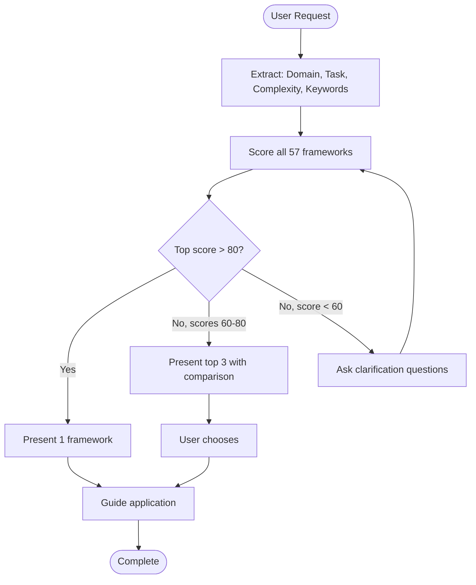

# PromptX

Match user requirements to optimal prompt frameworks via multi-dimensional scoring.

## When to Use

**Trigger phrases:** "Help me optimize a prompt for...", "What framework should I use for...", "How should I structure my prompt for...", "Need a framework for...", "Best approach for...", "Create a prompt for...", "Improve my prompt about..."

✅ Structured prompting strategies | Complex systematic tasks | Analytical work | Decision-making | Content creation | Problem-solving
❌ Simple factual queries | Direct code generation | Single-step requests | Routine conversations

## Workflow



## Scoring

```
Score = (Domain_Match × 0.30) + (Task_Match × 0.25) + (Keyword_Match × 0.20) + (Complexity_Match × 0.15) + (Examples_Bonus × 0.10)
```

**Thresholds:** >80 = single framework | 60-80 = top 3 comparison | <60 = ask clarification

**Tie-break:** examples_count > flexibility (high>med>low) > fewer components > lower ID

For details, read `references/scoring-algorithm.md`.

## Detection Quick Reference

**Domains:** education, business, creative, technical, decision, problem
**Tasks:** prompt_engineering, decision_making, problem_solving, content_creation, analysis, brainstorming
**Complexity:** simple (<50 words) | medium (50-100 words) | complex (>100 words)

For keyword rules, read `references/domain-mappings.md`.

## Execution Steps

1. **Load index:** Read `data/index.json` for all 57 framework metadata
2. **Detect:** Extract user's domain, task type, complexity, keywords from query
3. **Score:** Apply formula to all frameworks, sort descending
4. **Load details:** For top 1-3 matches (score >= 60), read `data/frameworks/{filename}` for examples and component details
5. **Present:** Use appropriate template from `references/presentation-templates.md`

If user names a specific framework by name, present it directly + show similar alternatives.

## References

- `references/scoring-algorithm.md` — Detailed scoring logic and worked examples
- `references/domain-mappings.md` — Complete keyword classification rules
- `references/framework-examples.md` — 7 worked response examples
- `references/presentation-templates.md` — Full output templates (single/multiple/ambiguous)
- `references/framework-categories.md` — All 6 category descriptions
- `references/edge-cases.md` — Red flags, troubleshooting, quality checklist
- `data/index.json` — Framework metadata (load at runtime)
- `data/frameworks/` — Individual framework files (load on-demand)
